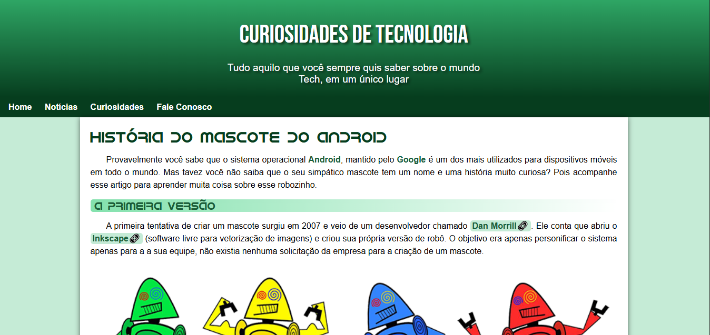
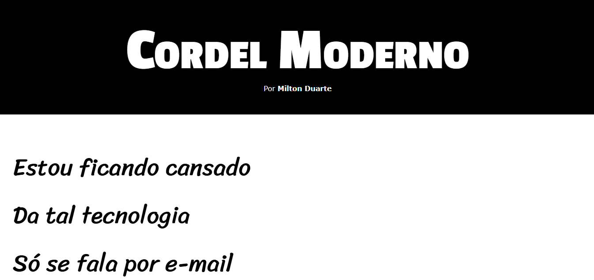
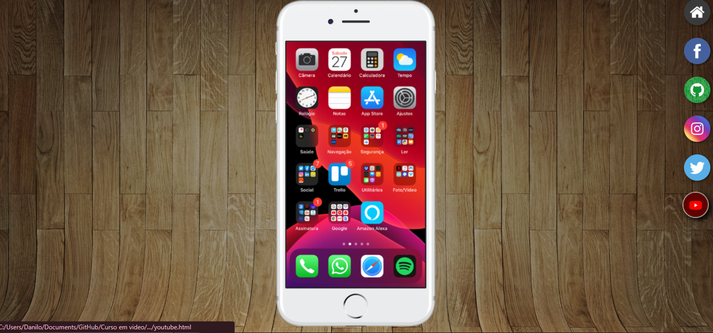
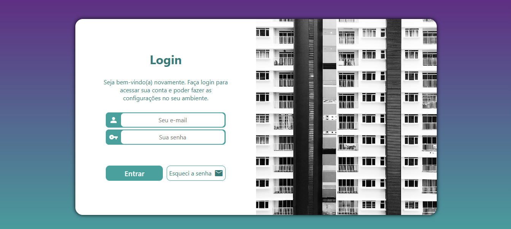

# 🧠 Projetos de Estudo – Curso em Vídeo (HTML5 & CSS3)

Este repositório reúne os projetos desenvolvidos durante minha jornada de aprendizado com o curso de **HTML5 e CSS3** do canal [Curso em Vídeo](https://www.youtube.com/@CursoemVideo).
Todos os projetos foram criados seguindo as aulas e têm como objetivo aplicar os conceitos fundamentais da construção de páginas web.

---

## 📂 Projetos

### Projeto 1 – Android



- **Descrição:** Um site simples que apresenta a história do sistema Android e seu mascote.
- **Aprendizado marcante:** Foi um ponto inicial essencial para entender HTML e CSS. Aprendi a adicionar links, incorporar vídeos e estruturar páginas básicas.

---

### Projeto 2 – Cordel



- **Descrição:** Um site com a apresentação de um cordel estilizado, utilizando formatação de texto e imagens de fundo.
- **Aprendizado marcante:** Foi a minha **primeira experiência prática com HTML5**, entendendo melhor como estruturar textos e elementos visuais.

---

### Projeto 3 – Rede Social



- **Descrição:** Página de links para redes sociais com imagens, ícones e responsividade básica.
- **Aprendizado marcante:** Aprendi a trabalhar melhor com **imagens, links e tamanhos de tela**, começando a entender como funciona o design responsivo.

---

### Projeto 4 – Tela de Login



- **Descrição:** Interface de login fictícia para um sistema de condomínio.
- **Aprendizado marcante:** Pratiquei mais sobre **layout responsivo**, vendo como uma mesma tela se comporta em diferentes dispositivos.

---

## 🧪 Como rodar localmente

1. Clone o repositório:

   ```bash
   git clone https://github.com/Danilo-Palacio/Projetos-HTML-Curso_em_video.git
   ```
2. Acesse a pasta do projeto desejado:

   ```bash
   cd nome-do-projeto
   ```
3. Abra o arquivo `.html` no navegador (pode arrastar o arquivo para o navegador ou usar clique duplo).

---

## 📝 Observação

Este repositório representa minha **primeira experiência com HTML5 e CSS3**, seguindo o conteúdo do Curso em Vídeo.
Foi um ponto de partida fundamental para começar a entender como funciona o desenvolvimento web.
